# MVC_PiePHP

## Export the database  

```bash
    mysqldump --user=your_username --password=your_pwd --databases cinema > cinema.sql
```
 
## Import he database  

```bash
    mysql --user=your_username --password=your_pwd cinema < cinema.sql
```

# Website preview

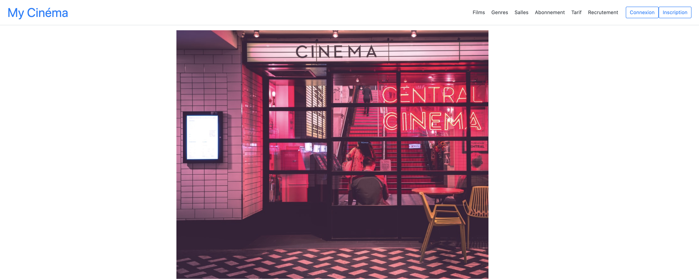
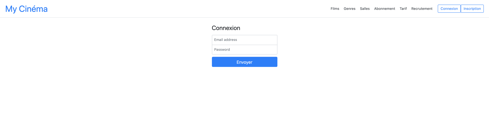
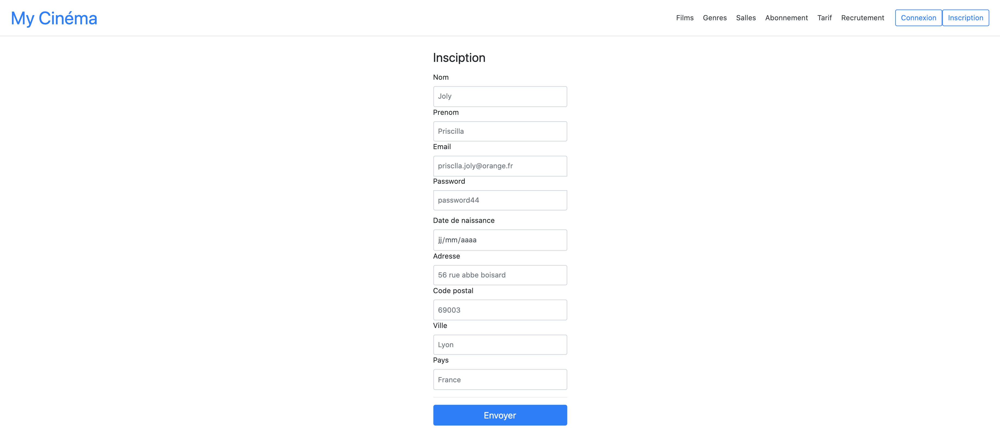
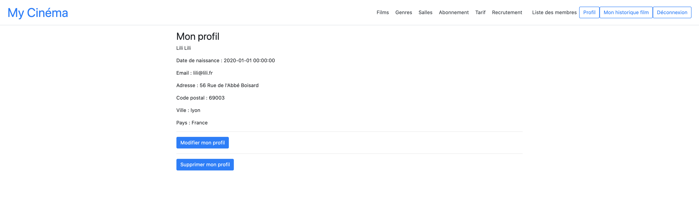
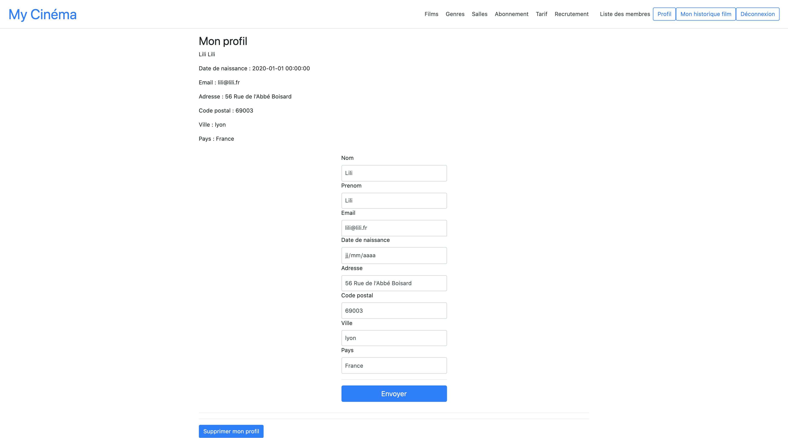
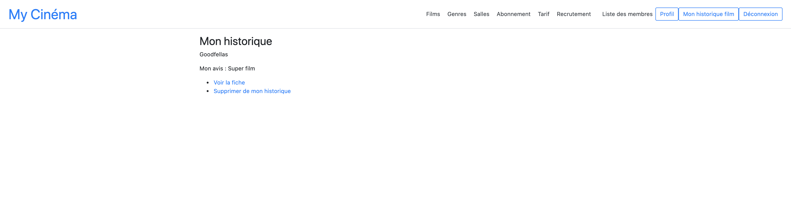

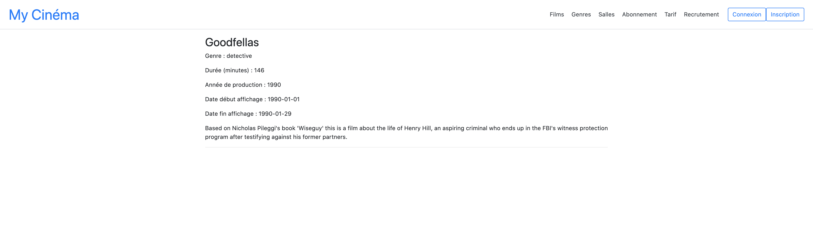
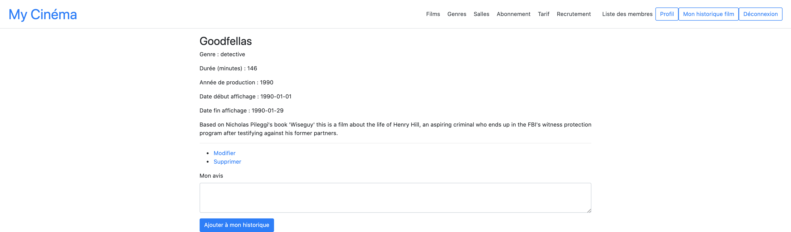

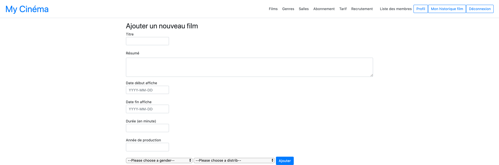
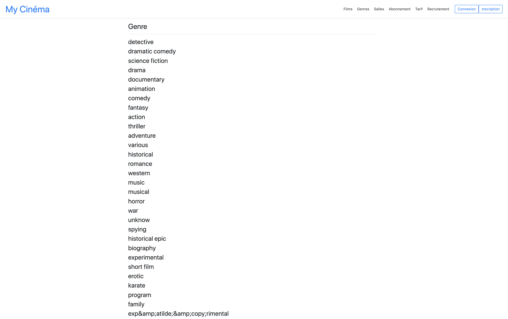

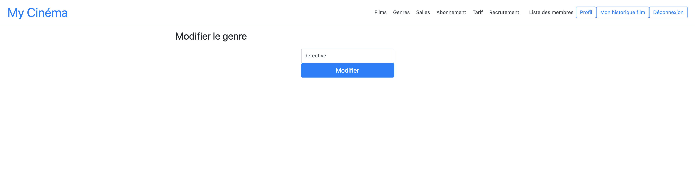

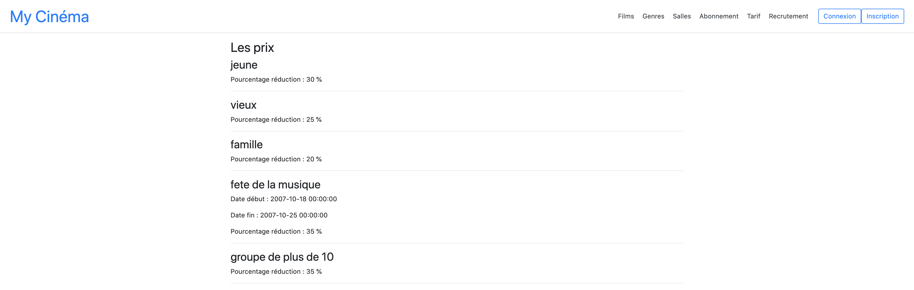
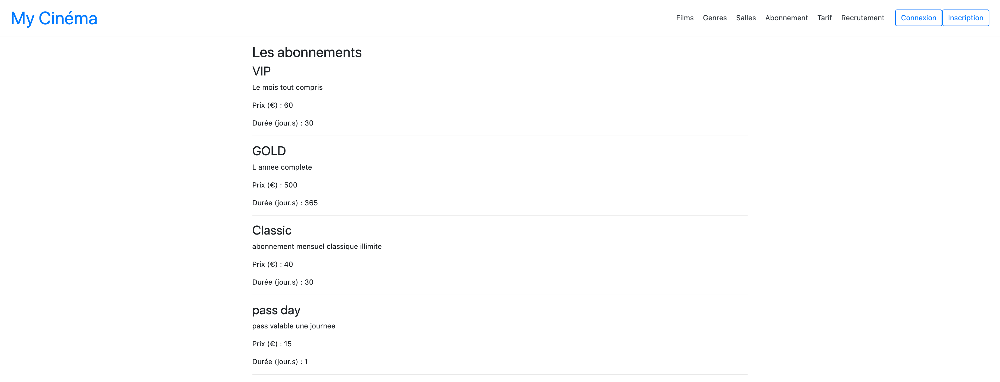
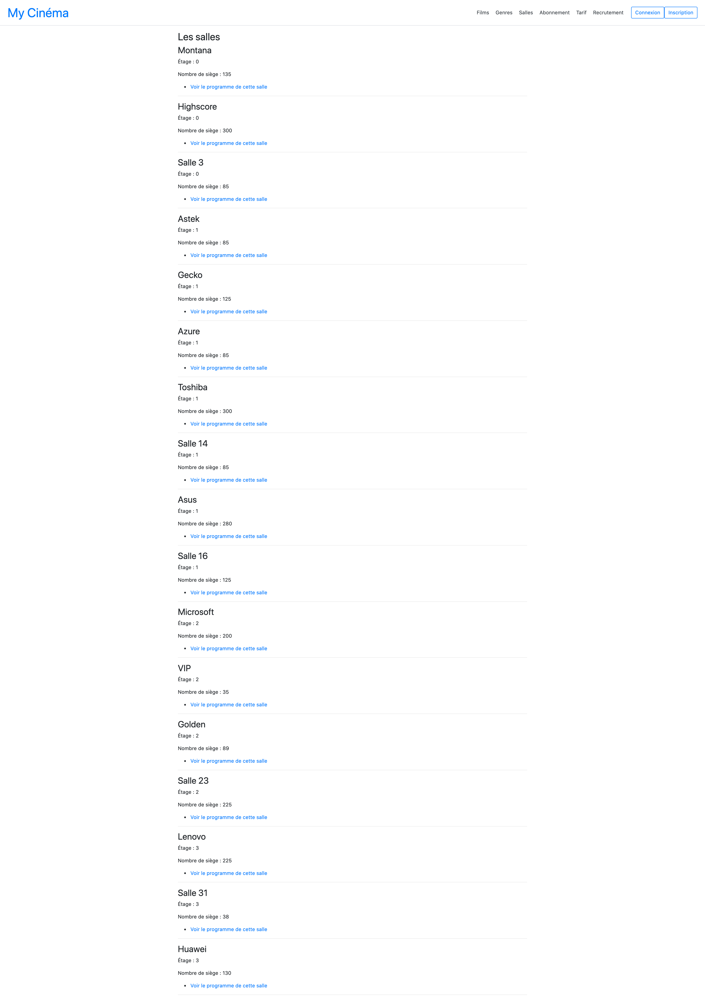
 